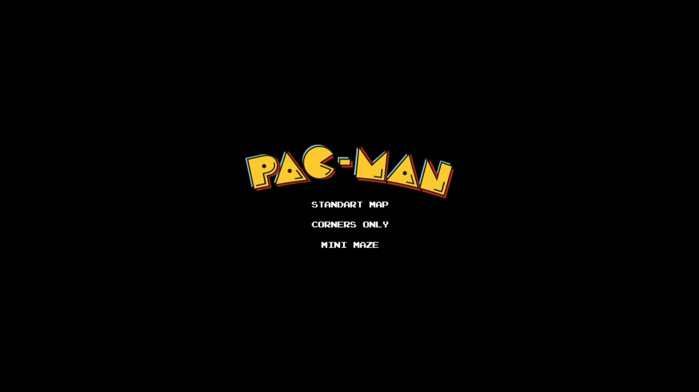
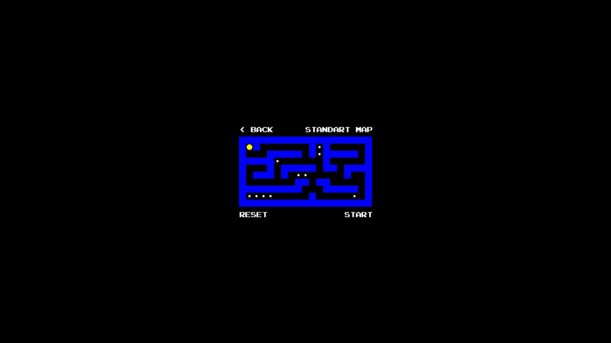

# Pacman maze solver in React.js

The goal of this project is to implement an algorithm that consistently find the shortest path which visits all dots in
a pacman maze.

## Installation guide

The project was written in React.js and in order to run the app install nodejs and run the following commands :

* npm install
* npm start

## Usage

After running the commands a local development server is started on the following address: http://localhost:3000.

The default home page shows a game menu where the user can choose one of the three displayed maps:



After a map is chosen the user is redirected to a screen with the game map. There are three action buttons to interact
with:

* back - goes back to the home screen
* start - start the algorithm and animates the solution
* reset - resets the map to the default state



## Solution

The solution is based on classic A* search consistently finding the optimal path.

### Search state

The search state consists of:
* current position of pacman
* list of remaining pellets
* the path already travelled

### Cost function

The cost function is the length of the path since the initial pacman start position:

```js
cost(path: Position[]): number {
    return path.length - 1;
}
```

### Heuristic

The key to finding the optimal solution is a good heuristic. The heuristic finds the distance between two pellets that have the largest distance between each other X and the distance between the position of pacman and the closer pellet Y. The heuristic is the sum of these two distances: X + Y.

The logic behind this approach is following:
* X - the largest distance between two pellets has to be travelled in any case
* Y - it's better to travel to the pellet from the pair that is closer to the current position of pacman

```js
heuristic(currentPosition: Position, remainingPellets: boolean[]): number {
    const remainingPelletsCnt: number = remainingPellets.filter(p => p).length;
    let furthestPellets: Pellet[] = []
    let furthestDistance: number = 0;

    if (remainingPelletsCnt === 0) {
        return 0;
    }

    if (remainingPelletsCnt === 1) {
        const index = remainingPellets.indexOf(true);
        return this.getDistance(currentPosition, this.pellets[index].position);
    }

    for (let i = 0; i < this.pellets.length; i++) {
        if (!remainingPellets[i]) {
            continue;
        }

        for (let j = 0; j < this.pellets.length; j++) {
            if (!remainingPellets[j]) {
                continue;
            }
            const distance = this.pelletDistances[i][j];
            if (distance > furthestDistance) {
                furthestDistance = distance;
                furthestPellets = [this.pellets[i], this.pellets[j]]
            }
        }
    }
    
    const distancesToPellets = furthestPellets.map(p => this.getDistance(currentPosition, p.position));
    return furthestDistance + Math.min(...distancesToPellets);
}
```

## Example

